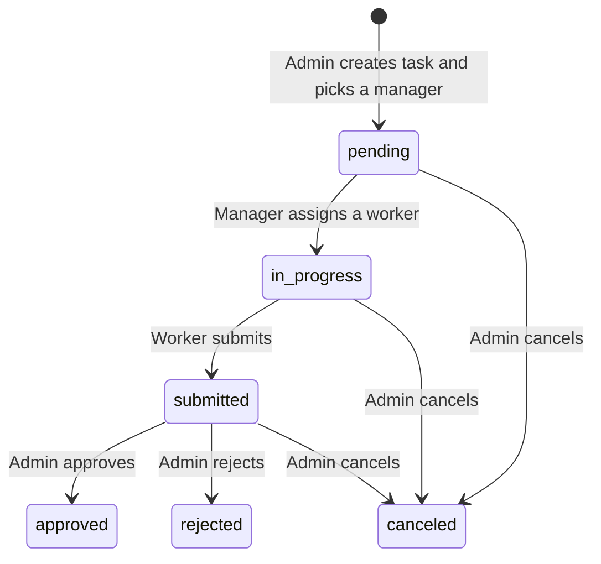

# Task Management System

A full-stack, role-based task management app. An **admin** creates tasks and assigns them to a **manager**, the manager hands them to a **worker**, the worker submits the result, and the admin reviews it. Every step is enforced on the server, not just hidden in the UI.

**Live demo:** TODO add link · **Demo login:** TODO add a throwaway demo account (never a real one)

<!-- TODO: add 2-3 screenshots, e.g. docs/screenshots/admin-dashboard.png -->
<!--  -->

## Features

- **Three roles** with separate dashboards: admin, manager, worker
- **Admin**: create tasks, edit/cancel them, approve or reject submitted work, register users, assign workers to managers, promote workers to managers and demote managers to workers
- **Manager**: see tasks assigned to them and delegate each one to a worker from their team
- **Worker**: see their own tasks and submit finished work for review
- **Task workflow** with strict status transitions and priorities (low / high / urgent)
- **Secure sessions**: short-lived access token plus a refresh token in an httpOnly cookie, with automatic silent refresh on the frontend
- **Organisation-only accounts**: only emails on the configured domain can log in; accounts are created by the admin (no public sign-up)
- Change-password flow, toast notifications, per-role dashboards with task statistics

## Tech stack

| Layer | Tools |
| --- | --- |
| Frontend | React 19, Vite, React Router 7, Tailwind CSS 4 (custom design tokens) |
| Backend | Node.js, Express 5, Mongoose 9 |
| Database | MongoDB (Atlas) |
| Auth | JWT (access + refresh), bcryptjs, cookie-parser, CORS |

## Task workflow



Changing a task's manager resets it to `pending` and clears the assigned worker. `approved`, `rejected` and `canceled` are final.

## Roles and permissions

| Action | Admin | Manager | Worker |
| --- | :---: | :---: | :---: |
| Register users | yes | - | - |
| Promote / demote / assign workers to managers | yes | - | - |
| Create tasks | yes | - | - |
| Edit task details, cancel, approve, reject | yes (own tasks) | - | - |
| Assign a task to a worker | - | yes (own team) | - |
| Submit a task | - | - | yes (own tasks) |
| View tasks | tasks they created | tasks they manage | tasks assigned to them |
| Change own password | yes | yes | yes |

## Getting started

### Prerequisites

- Node.js 20.19+ or 22.12+
- A MongoDB database ([MongoDB Atlas](https://www.mongodb.com/atlas) free tier works)

### 1. Clone

```bash
git clone https://github.com/<your-username>/task-management-system.git
cd task-management-system
```

### 2. Backend

```bash
cd backend
npm install
cp .env.example .env        # then fill in real values (see "Environment variables")
npm run seed:admin          # creates the first admin from ADMIN_* in .env
npm start                   # API on http://localhost:3000
```

### 3. Frontend

```bash
cd frontend
npm install
cp .env.example .env
npm run dev                 # app on http://localhost:5173
```

Log in with the admin account you seeded, then register a manager and a worker from the admin dashboard (new users start as workers; promote one to manager and assign workers to them).

## Environment variables

**Backend (`backend/.env`)**

| Variable | Purpose |
| --- | --- |
| `PORT` | API port (default in example: 3000) |
| `MONGODB_URI` | MongoDB connection string |
| `ACCESS_TOKEN_SECRET_KEY` / `ACCESS_TOKEN_EXPIRY` | Access token signing secret and lifetime (e.g. `15m`) |
| `REFRESH_TOKEN_SECRET_KEY` / `REFRESH_TOKEN_EXPIRY` | Refresh token signing secret (different from the access secret) and lifetime (e.g. `15d`) |
| `ORG_DOMAIN` | Only emails ending in this domain can log in or be registered |
| `CLIENT_URL` | Frontend origin allowed by CORS |
| `ADMIN_NAME`, `ADMIN_EMAIL`, `ADMIN_PASSWORD` | Used only by `npm run seed:admin` |

**Frontend (`frontend/.env`)**

| Variable | Purpose |
| --- | --- |
| `VITE_API_URL` | Base URL of the API, e.g. `http://localhost:3000/api` |

Real `.env` files are git-ignored. Only the `.env.example` templates are committed.

## API overview

All routes are prefixed with `/api`. Everything except login and token refresh needs an `Authorization: Bearer <accessToken>` header.

| Method | Route | Access | Description |
| --- | --- | --- | --- |
| POST | `/authentication/login` | public | Log in, returns access token and sets refresh cookie |
| GET | `/authentication/refresh-tokens` | refresh cookie | Rotate tokens |
| GET | `/authentication/logout` | any user | Invalidate the refresh token |
| GET | `/authentication/get-me` | any user | Current user |
| PATCH | `/authentication/change-pass` | any user | Change own password |
| POST | `/authentication/register-user` | admin | Create a user (starts as worker) |
| PATCH | `/user/admin/promote` | admin | Worker to manager |
| PATCH | `/user/admin/demote` | admin | Manager to worker |
| PATCH | `/user/admin/assign-worker` | admin | Put a worker on a manager's team |
| GET | `/user/admin/get-employee-list` | admin | Managers and workers registered by this admin |
| GET | `/user/manager/get_worker-list` | manager | Workers on the manager's team |
| POST | `/task/create-task` | admin | Create a task |
| GET | `/task/get-tasks` | any user | Tasks visible to the caller's role |
| PATCH | `/task/task-admin` | admin | Edit, reassign manager, approve, reject, cancel |
| PATCH | `/task/task-manager` | manager | Assign a worker |
| PATCH | `/task/task-worker` | worker | Submit work |

## Project structure

```
backend/
  config/            env + database setup
  features/
    admin/ authentication/ manager/ task/ user/
      route/ controller/ service/ model/   # route -> controller -> service -> model
  middleware/        auth + role guards (adminify, managerify, workerify)
  utils/             token generation, shared error/response classes
  scripts/           seed_admin.js
frontend/
  src/
    components/      shared UI (task card)
    context/         auth, tasks, employees, workers, toasts
    pages/           admin/ manager/ worker/ authentication/ (layout, controller, service)
    utils/           fetch wrapper with automatic token refresh
```

## Known limitations and roadmap

- Email verification and "forgot password" are not implemented yet
- No rate limiting or automated tests yet
- Rejected tasks are final (no rework loop)
- No pagination or search on task lists
- Planned: comments and activity history on tasks, due dates, notifications

## Author

Built by <your name> ([GitHub](https://github.com/<your-username>) · [LinkedIn](TODO)).

## License

TODO: add a LICENSE file (MIT is a common choice for portfolio projects).
